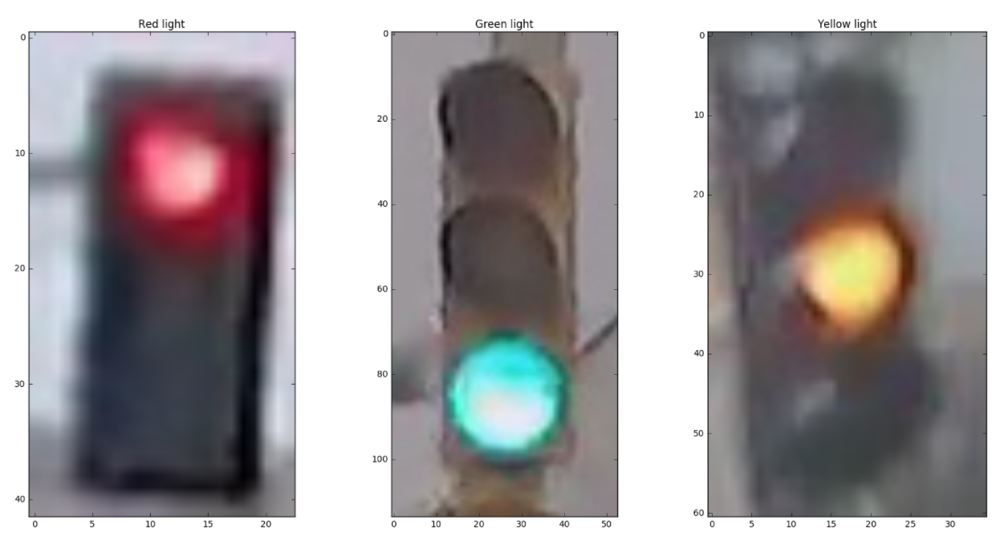

# Intro to Self Driving Car Udacity Final Project: Traffic Light Classifier

 Goal is to build a classifier model that recognizes state of traffic light, by recognizing which color is lit: Red, Yellow, or Green.
 

 ## Steps to develop the classifier:
 1. Loading and Visualizing the Traffic Light Dataset
 2. Pre-process the Data
 3. Feature Extraction
 4. Classify and Determine Accuracy of the model
 5. Improve the algorithm.

There are two criteria to pass the project:
   - Accuracy > 90%
   - Never miss a red light (green and yellow are forgivable, although missing any light is frustrating but the model should not cause devastating effects)
